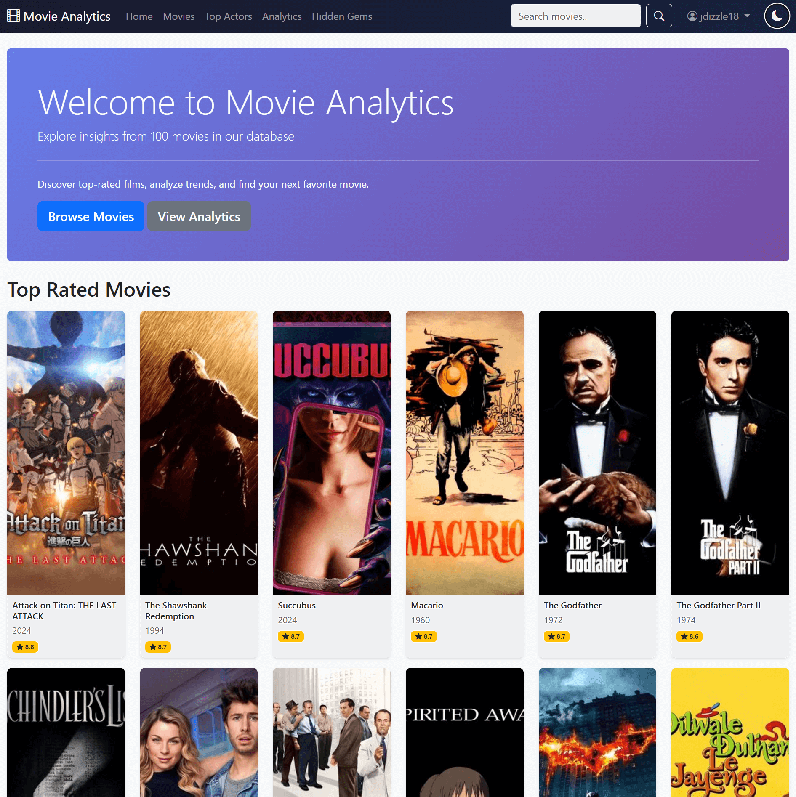
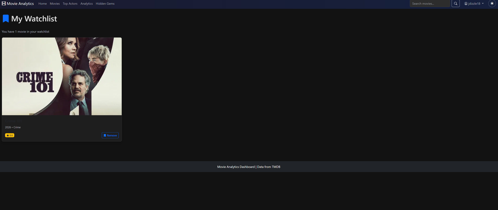

# 🎬 Movie Analytics Dashboard

> A full-stack movie discovery platform with user authentication, personalized collections, and comprehensive analytics — built to showcase modern web development skills.


<!-- Add this once deployed -->
<!-- 📺 **[Live Demo](your-deployed-url)** | 📹 **[Video Walkthrough](youtube-link)** -->



## 🚀 Quick Start

```bash
# Clone and setup
git clone https://github.com/jaime-builds/movie-analytics-dashboard.git
cd movie-analytics-dashboard
python -m venv venv && source venv/bin/activate  # or .\venv\Scripts\activate on Windows

# Install and configure
pip install -r requirements.txt
echo "TMDB_API_KEY=your_key_here" > config/.env
echo "SECRET_KEY=your_secret_here" >> config/.env

# Initialize and run
python -m src.models  # Create database
python scripts/sync_tmdb_data.py --limit 1000  # Quick initial data (5 min)
python -m src.app  # Start server at http://127.0.0.1:5000
```

Get your [TMDB API key here](https://www.themoviedb.org/settings/api) (free, takes 2 minutes).

## 💡 What Makes This Special

This isn't just another movie app. It's a **portfolio-grade full-stack application** that demonstrates:

### 🎯 Core Features

| Feature | Description |
|---------|-------------|
| 🔐 **Authentication** | Secure login/registration with password hashing |
| 💖 **Personalization** | Favorites & watchlist collections per user |
| 🎬 **Director Spotlight** | Explore 300+ directors with complete filmographies |
| 📊 **Analytics Dashboard** | Interactive Chart.js visualizations |
| 🔄 **Auto-Sync** | Automated daily updates from TMDB (5,000 movies) |
| 🎭 **Actor Profiles** | Top actors with photos and filmography |
| 💎 **Hidden Gems** | Smart algorithm discovers underrated films |
| 🌙 **Dark Mode** | Full theme support with localStorage |

### 🎨 User Experience

<div align="center">

| Favorites Collection | Watchlist Tracking |
|:-------------------:|:-----------------:|
|  |  |

</div>

**Personal movie collections** that persist across sessions, beautifully designed with responsive grid layouts.

## 🛠️ Technical Highlights

### Architecture & Design Patterns

```text
├── MVC Architecture (Flask + SQLAlchemy + Jinja2)
├── RESTful routing with protected routes
├── Session-based authentication
├── Normalized database schema (3NF)
├── Repository pattern for data access
└── Automated background jobs
```

### Advanced SQL Showcase

This project demonstrates **professional-grade SQL** including:

**Complex Joins & Aggregations**

```sql
-- Top actors with statistics
SELECT p.name, COUNT(c.movie_id) as movies, AVG(m.vote_average) as avg_rating
FROM people p
JOIN cast c ON p.id = c.person_id
JOIN movies m ON c.movie_id = m.id
WHERE m.vote_count > 20
GROUP BY p.id HAVING COUNT(c.movie_id) >= 2
ORDER BY movies DESC;
```

**Subqueries & Window Functions**

```sql
-- Similar movies using genre matching
SELECT m.*, COUNT(mg.genre_id) as genre_matches
FROM movies m
JOIN movie_genres mg ON m.id = mg.movie_id
WHERE mg.genre_id IN (SELECT genre_id FROM movie_genres WHERE movie_id = ?)
GROUP BY m.id
ORDER BY genre_matches DESC, m.vote_average DESC;
```

**Custom Algorithms**

```sql
-- Hidden gems formula: high rating, low popularity
SELECT * FROM movies
WHERE vote_average >= 7.0 AND popularity <= 20.0 AND vote_count >= 50
ORDER BY (vote_average / LOG(popularity + 2)) DESC;
```

### Tech Stack

**Backend**

- Python 3.10+ with Flask
- SQLAlchemy ORM
- Werkzeug password hashing
- Schedule for automation
- pytest for testing

**Frontend**

- Bootstrap 5 (responsive design)
- Chart.js (data visualization)
- Vanilla JavaScript (DOM manipulation)
- Jinja2 templating

**Database**

- SQLite (development)
- PostgreSQL-ready (production)
- Normalized schema with 12 tables
- Many-to-many relationships
- Compound indexes

**DevOps**

- Automated TMDB sync (daily)
- Comprehensive logging
- GitHub Actions CI/CD
- Environment-based config

## 📊 Project Stats

- **5,000** movies with complete metadata
- **300+** directors with filmographies
- **1,000+** actors with profiles
- **47** passing unit tests
- **12** database tables
- **15+** Flask routes
- **20+** Jinja2 templates

## 🎓 Skills Demonstrated

### Full-Stack Development

✅ Flask web framework & routing
✅ SQLAlchemy ORM with complex queries
✅ RESTful API design principles
✅ Session management & authentication
✅ Template inheritance & Jinja2
✅ Responsive UI with Bootstrap

### Database & SQL

✅ Schema design & normalization
✅ Complex JOINs & subqueries
✅ Aggregations & window functions
✅ Query optimization & indexing
✅ Many-to-many relationships
✅ Data modeling best practices

### Python & Best Practices

✅ Object-oriented programming
✅ API integration (TMDB)
✅ Error handling & logging
✅ Virtual environments
✅ Automated testing (pytest)
✅ Background job scheduling

### DevOps & Tools

✅ Git version control
✅ Environment configuration
✅ Automated data pipelines
✅ CI/CD with GitHub Actions
✅ Comprehensive documentation

## 📚 Detailed Documentation

<details>
<summary><b>📖 Full Installation Guide</b></summary>

### Prerequisites

- Python 3.8+
- pip package manager
- Git
- TMDB API key ([get free key](https://www.themoviedb.org/settings/api))

### Step-by-Step Setup

1. **Clone repository**

   ```bash
   git clone https://github.com/jaime-builds/movie-analytics-dashboard.git
   cd movie-analytics-dashboard
   ```

2. **Create virtual environment**

   ```bash
   python -m venv venv

   # Windows
   .\venv\Scripts\activate

   # macOS/Linux
   source venv/bin/activate
   ```

3. **Install dependencies**

   ```bash
   pip install -r requirements.txt
   ```

4. **Configure environment**

   Create `config/.env`:

   ```env
   TMDB_API_KEY=your_api_key_here
   DATABASE_URL=sqlite:///movies.db
   SECRET_KEY=your_secret_key_here
   ```

5. **Initialize database**

   ```bash
   python -m src.models
   ```

6. **Import movie data**

   ```bash
   # Quick start (1,000 movies, ~5 minutes)
   python scripts/sync_tmdb_data.py --limit 1000

   # Full dataset (5,000 movies, ~30 minutes)
   python scripts/sync_tmdb_data.py --limit 5000
   ```

7. **Run application**

   ```bash
   python -m src.app
   ```

   Visit: <http://127.0.0.1:5000>

8. **Optional: Enable auto-sync**

   ```bash
   python scripts/scheduler.py
   ```

</details>

<details>
<summary><b>🗂️ Database Schema</b></summary>

### Tables

**Core Tables**

- `movies` - 5,000+ films with metadata, ratings, financial data
- `genres` - 19 movie genres
- `people` - Actors, directors, crew (with profile images)
- `production_companies` - Studios and production companies

**Relationships**

- `movie_genres` - Many-to-many (movies ↔ genres)
- `movie_companies` - Many-to-many (movies ↔ companies)
- `cast` - Movie cast with character names
- `crew` - Movie crew with job titles

**User System**

- `users` - Authentication with hashed passwords
- `user_favorites` - Many-to-many (users ↔ favorite movies)
- `user_watchlist` - Many-to-many (users ↔ watchlist movies)

### ER Diagram

```text
users ─┬─< user_favorites >─┬─ movies ─┬─< movie_genres >─┬─ genres
       │                     │          │                   │
       └─< user_watchlist >──┘          ├─< movie_companies >─ production_companies
                                        │
                                        ├─< cast >──── people
                                        │
                                        └─< crew >──── people
```

</details>

<details>
<summary><b>🧪 Testing</b></summary>

### Run Tests

```bash
# All tests
pytest

# With coverage
pytest --cov=src --cov-report=html

# Specific test file
pytest tests/test_auth.py -v
```

### Test Coverage

- ✅ User authentication (registration, login, logout)
- ✅ Password validation
- ✅ Favorites add/remove
- ✅ Watchlist add/remove
- ✅ Session management
- ✅ Database relationships
- ✅ Security (password hashing)

**Current Coverage**: 47 tests passing

</details>

<details>
<summary><b>🔄 Data Synchronization</b></summary>

### Manual Sync

```bash
# Sync 5000 movies
python scripts/sync_tmdb_data.py --limit 5000

# Update existing movies
python scripts/sync_tmdb_data.py --limit 5000 --update-existing

# Update only recent changes (last 7 days)
python scripts/sync_tmdb_data.py --recent-only --days 7
```

### Automated Sync

The scheduler runs:

- **Daily full sync** at 2:00 AM (5,000 movies)
- **Hourly updates** for recently modified movies

```bash
# Start scheduler
python scripts/scheduler.py

# Run as background service
nohup python scripts/scheduler.py &
```

### What Gets Synced

- ✅ Movie metadata (title, overview, release date)
- ✅ Ratings and popularity
- ✅ Cast and crew (top 10 actors)
- ✅ Director information
- ✅ Production companies
- ✅ Genres
- ✅ Poster and backdrop images
- ✅ Actor profile photos

</details>

<details>
<summary><b>🎨 Features Deep Dive</b></summary>

### Director Spotlight

- Browse 300+ directors
- Complete filmographies with statistics
- Career timeline charts (ratings over time, box office)
- Genre distribution analysis
- Grid and list view options
- Filter by movie count

### Hidden Gems Algorithm

```python
gem_score = vote_average / (log(popularity + 2) * 2)
```

Finds high-quality, underappreciated films by balancing:

- High rating (≥7.0)
- Low popularity (≤20.0)
- Sufficient votes (≥50)

### Analytics Dashboard

- **Genre Distribution** - Pie chart
- **Release Timeline** - Bar chart by year
- **Ratings by Genre** - Horizontal bar chart
- **Budget vs Revenue** - Financial analysis
- **Top Studios** - Production company rankings

All charts are:

- Interactive (hover for details)
- Responsive (mobile-friendly)
- Dark mode compatible

</details>

## 🚀 Future Roadmap

See [TODO.md](TODO.md) for the complete roadmap.

### Next Sprint

- [ ] Movie ratings & reviews
- [ ] User-based recommendations
- [ ] RESTful API endpoints
- [ ] Mobile app (React Native)

### Coming Soon

- [ ] Export analytics (PDF/CSV)
- [ ] Social sharing
- [ ] Email notifications
- [ ] PostgreSQL migration
- [ ] Docker deployment

## 📝 License

This project is open source and available under the [MIT License](LICENSE).

## 🤝 Contributing

Contributions, issues, and feature requests are welcome!

1. Fork the project
2. Create your feature branch (`git checkout -b feature/AmazingFeature`)
3. Commit your changes (`git commit -m 'Add some AmazingFeature'`)
4. Push to the branch (`git push origin feature/AmazingFeature`)
5. Open a Pull Request

## 📬 Contact

**Jaime De La Paz**

[](https://github.com/jaime-builds)
[](https://www.linkedin.com/in/jaimedelapaz)

⭐ **Star this repo** if you found it helpful!

## 🙏 Acknowledgments

- [The Movie Database (TMDB)](https://www.themoviedb.org/) for movie data
- [Bootstrap](https://getbootstrap.com/) for UI components
- [Chart.js](https://www.chartjs.org/) for data visualization
- [UI Avatars](https://ui-avatars.com/) for generated profile images

<div align="center">

**Built with ❤️ as a portfolio project**

*Showcasing full-stack development with Python, Flask, SQL, and modern web technologies*

</div>
