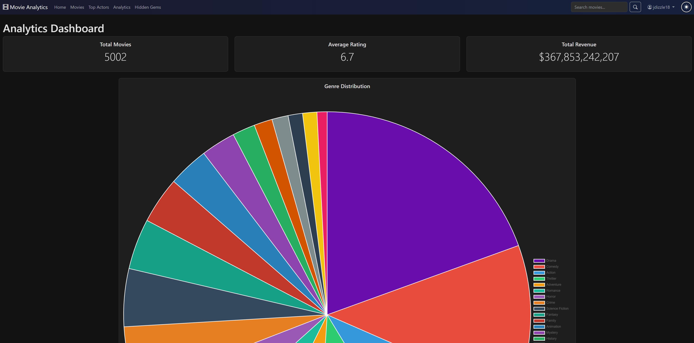

# Movie Analytics Dashboard

A full-stack web application for exploring and analyzing movie data using Flask, SQLAlchemy, and the TMDB API. This project demonstrates Python, SQL, web development, and data visualization skills.


## Features

- **Browse Movies**: Explore a collection of 1,000+ popular movies with poster images and pagination
- **Detailed Movie Pages**: View comprehensive information including cast, crew, ratings, revenue, and YouTube trailers
- **Advanced Search**: Search movies by title or description
- **Filter & Sort**: Filter by genre and sort by popularity, rating, or release date
- **Analytics Dashboard**: Interactive visualizations with Chart.js including:
  - Genre distribution (pie chart)
  - Movies released by year (bar chart)
  - Average ratings by genre (horizontal bar chart)
  - Budget vs. revenue analysis
  - Top production companies
- **Dark Mode**: Toggle between light and dark themes for comfortable viewing
- **Movie Trailers**: Watch official YouTube trailers directly on movie detail pages

## Tech Stack

- **Backend**: Python, Flask
- **Database**: SQLite with SQLAlchemy ORM
- **API**: The Movie Database (TMDB) API
- **Frontend**: HTML, CSS, Bootstrap 5, Chart.js
- **Version Control**: Git

## Database Schema

The application uses a normalized relational database with the following tables:

- `movies` - Core movie information
- `genres` - Movie genres
- `movie_genres` - Many-to-many relationship between movies and genres
- `people` - Actors, directors, and crew members
- `cast` - Movie cast information
- `crew` - Movie crew information
- `production_companies` - Production company details
- `movie_companies` - Many-to-many relationship between movies and companies

## Project Structure
```
movie-analytics-dashboard/
├── config/
│   ├── .env                 # Environment variables (API keys)
│   └── config.py           # Application configuration
├── database/
│   ├── schema.sql          # Database schema
│   └── migrations/         # Database migrations
├── src/
│   ├── models.py           # SQLAlchemy models
│   ├── tmdb_api.py         # TMDB API client
│   ├── data_import.py      # Data import scripts
│   └── app.py              # Flask application
├── templates/              # HTML templates
├── static/
│   ├── css/               # Stylesheets
│   ├── js/                # JavaScript files
│   └── images/            # Images
├── docs/                  # Documentation and screenshots
├── tests/                 # Unit tests
├── .gitignore
├── requirements.txt       # Python dependencies
└── README.md
```

## Installation & Setup

### Prerequisites

- Python 3.8+
- pip
- Git

### Steps

1. **Clone the repository**
```bash
   git clone https://github.com/jdizzle18/movie-analytics-dashboard.git
   cd movie-analytics-dashboard
```

2. **Create and activate virtual environment**
```bash
   python -m venv venv

   # On Windows
   .\venv\Scripts\activate

   # On macOS/Linux
   source venv/bin/activate
```

3. **Install dependencies**
```bash
   pip install -r requirements.txt
```

4. **Get TMDB API Key**
   - Sign up at [themoviedb.org](https://www.themoviedb.org/)
   - Go to Settings → API → Request API Key
   - Choose "Developer" and fill out the form
   - Copy your API Key (v3 auth)

5. **Configure environment variables**

   Create `config/.env`:
```
   TMDB_API_KEY=your_api_key_here
   DATABASE_URL=sqlite:///movies.db
```

6. **Initialize database**
```bash
   python -m src.models
```

7. **Import movie data**
```bash
   python -m src.data_import
```
   This will import 1,000 popular movies with cast, crew, and metadata (takes 5-10 minutes).

8. **Run the application**
```bash
   python -m src.app
```

   Open your browser to: `http://127.0.0.1:5000`

## SQL Queries Showcase

This project demonstrates various SQL concepts:

- **Complex JOINs**: Multi-table queries joining movies, genres, cast, and crew
- **Aggregations**: GROUP BY, COUNT, AVG for analytics
- **Subqueries**: Finding similar movies based on genre overlap
- **Indexes**: Performance optimization on frequently queried columns
- **Many-to-Many Relationships**: Junction tables for movies-genres and movies-companies

Example query from the analytics dashboard:
```sql
SELECT
    g.name,
    AVG(m.vote_average) as avg_rating,
    COUNT(m.id) as movie_count
FROM genres g
JOIN movie_genres mg ON g.id = mg.genre_id
JOIN movies m ON mg.movie_id = m.id
WHERE m.vote_count > 50
GROUP BY g.name
HAVING COUNT(m.id) >= 3
ORDER BY avg_rating DESC;
```

## Key Features Demonstrated

### Python Skills
- Object-oriented programming with SQLAlchemy models
- API integration and data parsing (TMDB API for trailers and metadata)
- Error handling and data validation
- Virtual environments and dependency management

### SQL Skills
- Database schema design with normalization
- Complex queries with multiple JOINs
- Aggregate functions and GROUP BY
- Many-to-many relationships
- Query optimization with indexes

### Web Development
- RESTful routing with Flask
- Template inheritance with Jinja2
- Responsive design with Bootstrap
- Interactive data visualization with Chart.js
- Client-side state management (dark mode toggle with localStorage)
- YouTube embed integration for trailers

### Git & Version Control
- Meaningful commit messages
- Proper .gitignore configuration
- Branch management
- Remote repository management

## Analytics Visualizations

The analytics dashboard features interactive Chart.js visualizations:

- **Genre Distribution Pie Chart**: Visual breakdown of movies by genre
- **Movies by Year Bar Chart**: Timeline of movie releases
- **Average Ratings by Genre**: Horizontal bar chart showing which genres rate highest
- **Budget vs Revenue Analysis**: Compare production costs to box office performance
- **Top Production Companies**: Bar chart of most prolific studios

All charts are fully responsive and adapt to dark mode for optimal viewing.



## Future Enhancements

- [ ] User authentication and personalized recommendations
- [ ] Movie ratings and reviews system
- [ ] Advanced filtering (by decade, rating range, runtime)
- [ ] Favorites/watchlist system
- [ ] Hidden Gems page - high rated, low popularity movies
- [ ] Director Spotlight page
- [ ] Export analytics reports as PDF
- [ ] RESTful API endpoints
- [ ] PostgreSQL migration for production
- [ ] Docker containerization
- [ ] Deployment to Heroku/Railway

## Contributing

Contributions are welcome! Please feel free to submit a Pull Request.

## License

This project is open source and available under the [MIT License](LICENSE).

## Acknowledgments

- Movie data provided by [The Movie Database (TMDB)](https://www.themoviedb.org/)
- Bootstrap for UI components
- Chart.js for data visualization


## Contact

**JD**
- GitHub: [@jdizzle18](https://github.com/jdizzle18)
- Project Link: [https://github.com/jdizzle18/movie-analytics-dashboard](https://github.com/jdizzle18/movie-analytics-dashboard)

---

*This project was created as a portfolio piece to demonstrate full-stack development skills with Python, SQL, and web technologies.*
